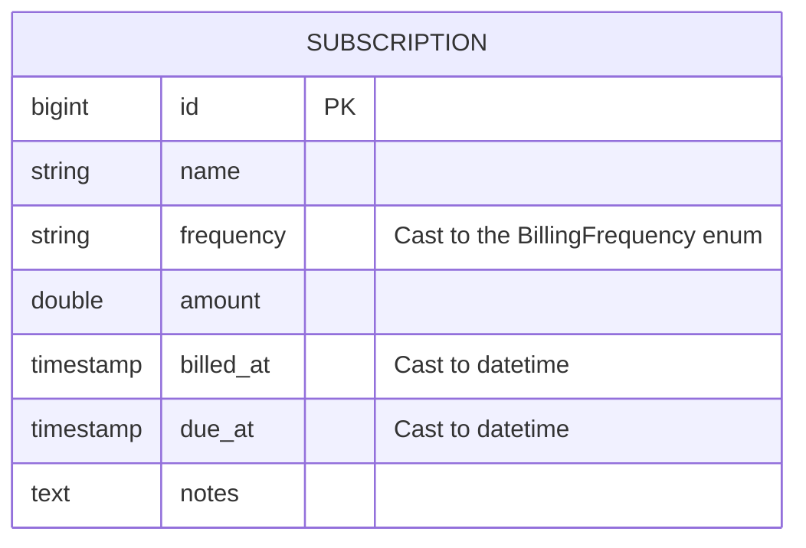
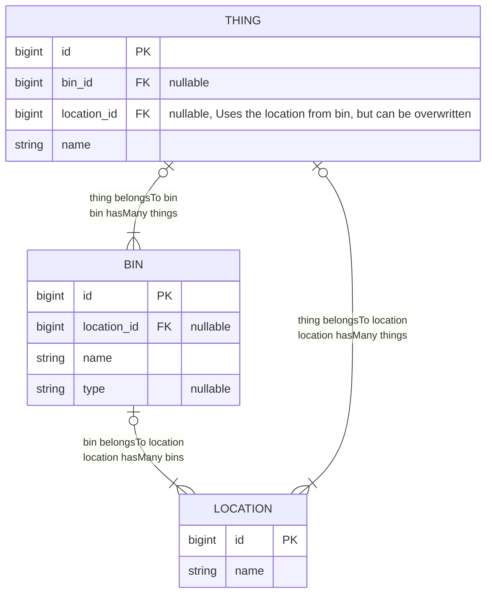
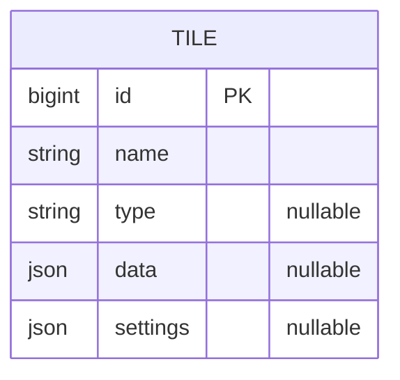
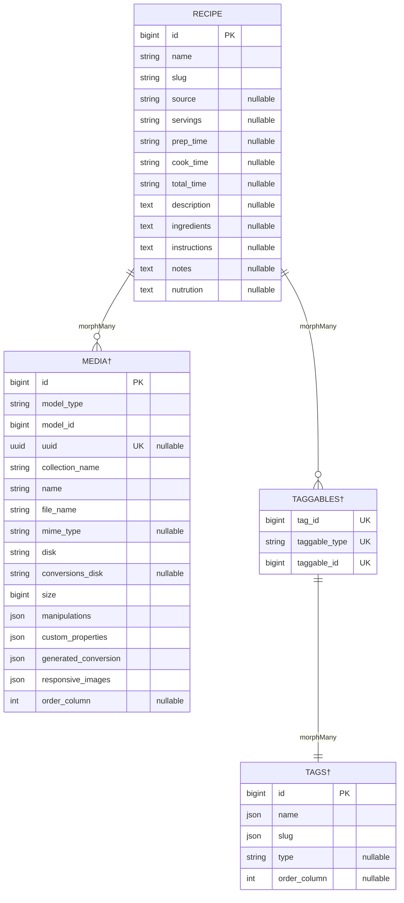
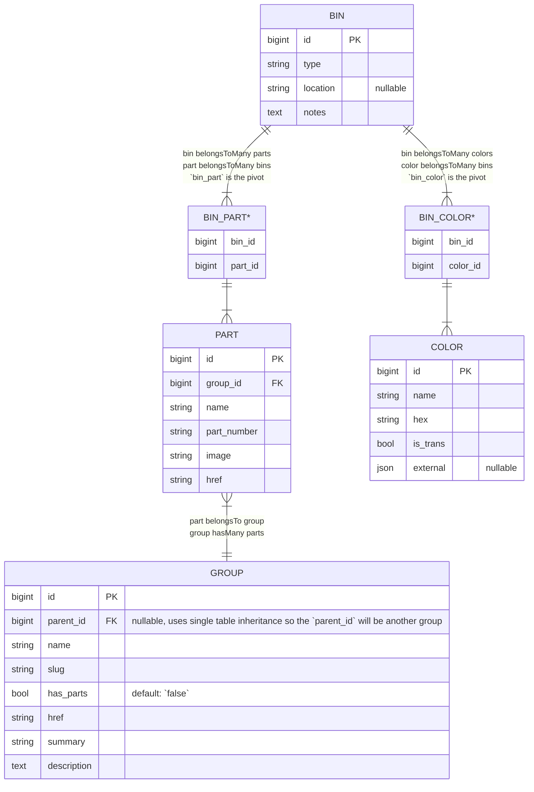

# Sunny

This application is one that I am building for my spouse and I to manage our lives/household. I am not striving for this app to be perfect, but as a playground for me to play with new technologies, packages and approaches. You can listen to more about this side project on the [Side Project podcast](https://sideprojectpodcast.com/episodes/sunny-with-andy-newhouse).

I do hope that this repo can be used as a resource for how I approach bulding data models, Livewire components, and testing.

App Sections:
- Berries
- Inventory
- Log Pose
- Cookbook
- Collections

> [!NOTE]
> For all Entity-Relationship diagrams assume the table has Laravel timestamp columns (`created_at`, `updated_at`) unless otherwise specified.

## Berries

Tables in this section are prefixed with `berries_` i.e. `berries_subscriptions`. This makes looking at data in TablePlus more organized.

## Inventory

## Log Pose

The `tile` model is extended from Spatie's Dashboard Tile model which is why it's table name is `dashboard_tiles`

## Cookbook

† The `media`, `tags` and `taggables` tables are all defined by Spatie packages. It's interesting that there are two approaches to the same time of relationship. The [laravel-tags](https://spatie.be/docs/laravel-tags/v4/introduction) package uses a pivot table, where the [laravel-medialibrary](https://spatie.be/docs/laravel-medialibrary/v11/introduction) does not.

## Collections

### LEGO

Tables in this section are prefixed with `lego_` i.e. `lego_parts`. This makes looking at data in TablePlus more organized.

Models in this section are prefixed with `Lego` i.e. `LegoBin`. This is to differentiate the LEGO collection from the models in the Inventory section.

* `bin_color` and `bin_part` are pivot tables, and do not have `id`, `created_at` or `updated_at` columns.
