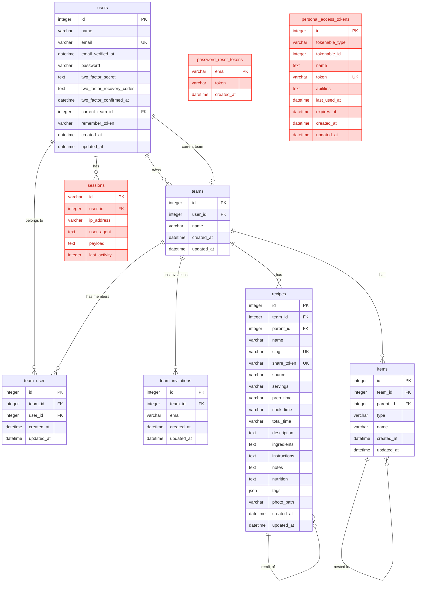

# Sunny

**PHP:** 8.4  
**Laravel:** 12  
**Node:** 22  
**Asset Compiler:** Vite  
**Database:** Postgres 18  
**Frontend:** [Livewire v4](https://livewire.laravel.com/docs/quickstart)  
**Testing:** [Pest v4](https://pestphp.com/docs/installation)  
**Hosting:** Cloud  
**Monitoring:** Nightwatch  

**Notible Composer Packages:**
- [driftingly/rector-laravel](https://github.com/driftingly/rector-laravel)
- [livewire/flux-pro](https://fluxui.dev/)
- [laravel/boost](https://github.com/laravel/boost)
- [nunomaduro/essentials](https://github.com/nunomaduro/essentials)

**Notible NPM Packages:**
- [playwright](https://github.com/microsoft/playwright)
- [tailwindcss](https://tailwindcss.com/)
- [tailwindcss/typography](https://github.com/tailwindlabs/tailwindcss-typography)

## ERD

| Color | Meaning |
| --- | --- |
| Blue | Application tables |
| Red Orange | Laravel default tables |

```mermaid
---
config:
  theme: default
---
erDiagram
	direction TB
	users {
		integer id PK ""
		varchar name  ""
		varchar email UK ""
		datetime email_verified_at  ""
		varchar password  ""
		text two_factor_secret  ""
		text two_factor_recovery_codes  ""
		datetime two_factor_confirmed_at  ""
		integer current_team_id FK ""
		varchar remember_token  ""
		datetime created_at  ""
		datetime updated_at  ""
	}

	teams {
		integer id PK ""
		integer user_id FK ""
		varchar name  ""
		datetime created_at  ""
		datetime updated_at  ""
	}

	team_user {
		integer id PK ""
		integer team_id FK ""
		integer user_id FK ""
		datetime created_at  ""
		datetime updated_at  ""
	}

	sessions {
		varchar id PK ""
		integer user_id FK ""
		varchar ip_address  ""
		text user_agent  ""
		text payload  ""
		integer last_activity  ""
	}

	team_invitations {
		integer id PK ""
		integer team_id FK ""
		varchar email  ""
		datetime created_at  ""
		datetime updated_at  ""
	}

	recipes {
		integer id PK ""
		integer team_id FK ""
		integer parent_id FK ""
		varchar name  ""
		varchar slug UK ""
		varchar share_token UK ""
		varchar source  ""
		varchar servings  ""
		varchar prep_time  ""
		varchar cook_time  ""
		varchar total_time  ""
		text description  ""
		text ingredients  ""
		text instructions  ""
		text notes  ""
		text nutrition  ""
		json tags  ""
		varchar photo_path  ""
		datetime created_at  ""
		datetime updated_at  ""
	}

	items {
		integer id PK ""
		integer team_id FK ""
		integer parent_id FK ""
		varchar type  ""
		varchar name  ""
		datetime created_at  ""
		datetime updated_at  ""
	}

password_reset_tokens {
		varchar email PK ""
		varchar token  ""
		datetime created_at  ""
	}

	personal_access_tokens {
		integer id PK ""
		varchar tokenable_type  ""
		integer tokenable_id  ""
		text name  ""
		varchar token UK ""
		text abilities  ""
		datetime last_used_at  ""
		datetime expires_at  ""
		datetime created_at  ""
		datetime updated_at  ""
	}

	users||--o{teams:"owns"
	users||--o{team_user:"belongs to"
	users||--o|teams:"current team"
	users||--o{sessions:"has"
	teams||--o{team_user:"has members"
	teams||--o{team_invitations:"has invitations"
	teams||--o{recipes:"has"
	teams||--o{items:"has"
	recipes||--o{recipes:"remix of"
	items||--o{items:"nested in"

	sessions:::Laravel
	password_reset_tokens:::Laravel
	personal_access_tokens:::Laravel

	classDef Rose :,stroke-width:1px, stroke-dasharray:none, stroke:#FF5978, fill:#FFDFE5, color:#8E2236
	classDef Laravel stroke:#FF2D20, fill:#FFD6D4, color:#BF2118
```
