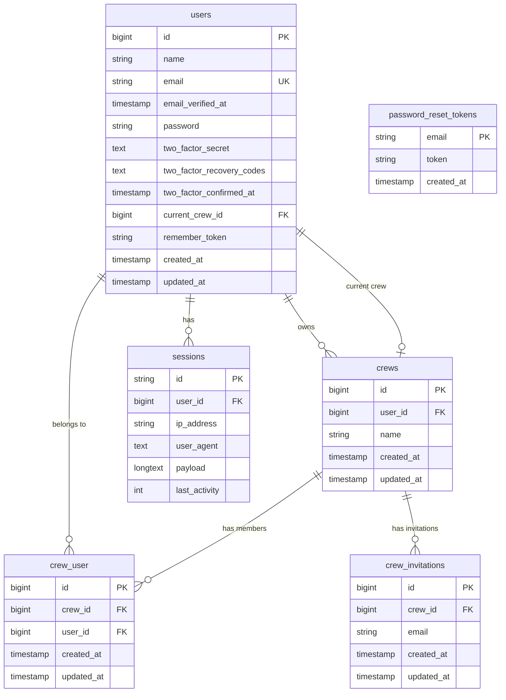

# Sunny

**PHP:** 8.4  
**Laravel:** 12  
**Node:** 22  
**Asset Compiler:** Vite  
**Database:** MySQL  
**Frontend:** [Livewire v4](https://livewire.laravel.com/docs/quickstart)  
**Testing:** [Pest v4](https://pestphp.com/docs/installation)  
**Hosting:** Forge  
**Monitoring:** Nightwatch

## ERD

```mermaid
erDiagram
    users ||--o{ crews : "owns"
    users ||--o{ crew_user : "belongs to"
    users ||--o| crews : "current crew"
    users ||--o{ sessions : "has"
    crews ||--o{ crew_user : "has members"
    crews ||--o{ crew_invitations : "has invitations"

    users {
        bigint id PK
        string name
        string email UK
        timestamp email_verified_at
        string password
        text two_factor_secret
        text two_factor_recovery_codes
        timestamp two_factor_confirmed_at
        bigint current_crew_id FK
        string remember_token
        timestamp created_at
        timestamp updated_at
    }

    crews {
        bigint id PK
        bigint user_id FK
        string name
        timestamp created_at
        timestamp updated_at
    }

    crew_user {
        bigint id PK
        bigint crew_id FK
        bigint user_id FK
        timestamp created_at
        timestamp updated_at
    }

    crew_invitations {
        bigint id PK
        bigint crew_id FK
        string email
        timestamp created_at
        timestamp updated_at
    }

    sessions {
        string id PK
        bigint user_id FK
        string ip_address
        text user_agent
        longtext payload
        int last_activity
    }

    password_reset_tokens {
        string email PK
        string token
        timestamp created_at
    }
```

