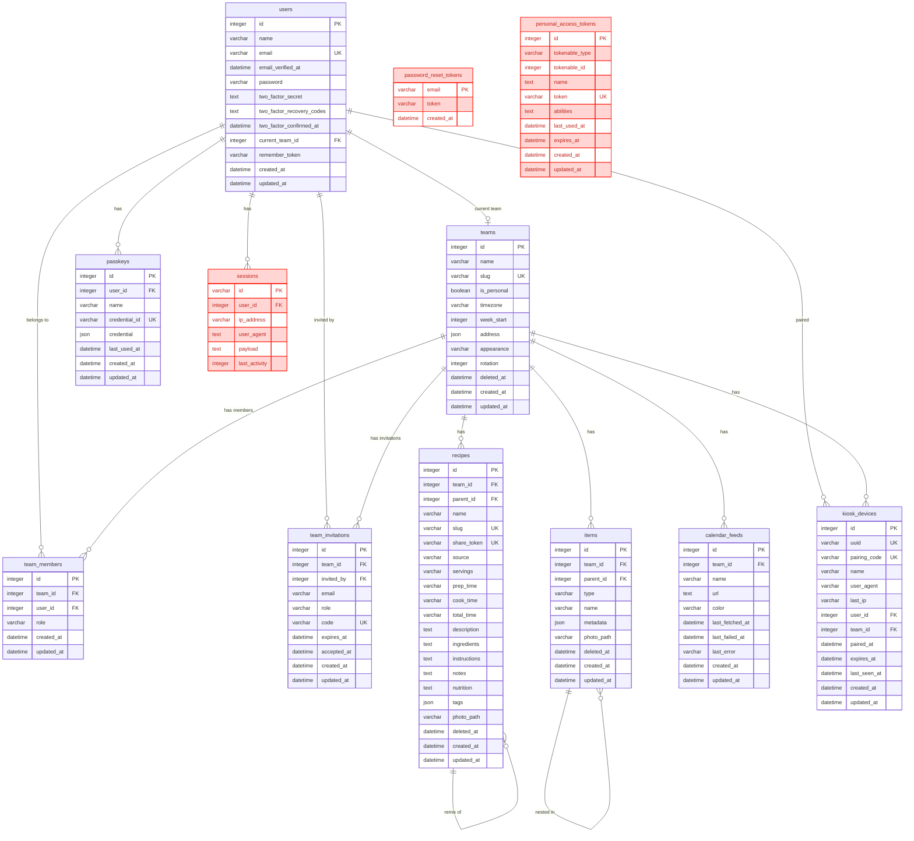

# Sunny

**PHP:** 8.4
**Laravel:** 13
**Node:** 22
**Asset Compiler:** Vite
**Database:** Postgres 18
**Frontend:** [Livewire v4](https://livewire.laravel.com/docs/quickstart)
**Testing:** [Pest v4](https://pestphp.com/docs/installation)
**Hosting:** Cloud
**Monitoring:** Nightwatch

**Notable Composer Packages:**
- [bentonow/bento-laravel-sdk](https://github.com/bentonow/bento-laravel-sdk)
- [dedoc/scramble](https://scramble.dedoc.co/)
- [driftingly/rector-laravel](https://github.com/driftingly/rector-laravel)
- [laravel/boost](https://github.com/laravel/boost)
- [laravel/chisel](https://github.com/laravel/chisel)
- [laravel/fortify](https://github.com/laravel/fortify)
- [laravel/mcp](https://github.com/laravel/mcp)
- [laravel/pao](https://github.com/laravel/pao)
- [laravel/pennant](https://github.com/laravel/pennant)
- [livewire/flux-pro](https://fluxui.dev/)
- [nunomaduro/essentials](https://github.com/nunomaduro/essentials)
- [petebishwhip/laradocs](https://github.com/PeteBishwhip/laradocs)
- [sabre/vobject](https://github.com/sabre-io/vobject)
- [saloonphp/saloon](https://docs.saloon.dev/)
- [spatie/simple-excel](https://github.com/spatie/simple-excel)
- [tightenco/duster](https://github.com/tighten/duster)

**Notable NPM Packages:**
- [@laravel/passkeys](https://www.npmjs.com/package/@laravel/passkeys)
- [playwright](https://github.com/microsoft/playwright)
- [tailwindcss](https://tailwindcss.com/)
- [tailwindcss/typography](https://github.com/tailwindlabs/tailwindcss-typography)

### Helpful Commands

- `composer run setup`
    Sets up the repo for development by installing PHP dependencies, creating the `.env` file if missing, generating the app key, running database migrations, and installing and building the frontend assets with npm.

- `composer run dev`
    Runs multiple development tasks in parallel using `npx concurrently`, including serving the site, running the queues, running `pail`, and compiling frontend assets.

- `composer run lint`
    Runs Rector and Duster to standardize the codebase.

- `composer run lint:check`
    Runs Rector and Duster in check-only mode, without applying fixes.

- `composer run ci:check`
    Runs all the commands that GitHub Actions will run, including Rector, Duster, PHPStan, and the test suite.

- `composer run stan`
    Runs PHPStan to check the codebase for type safety.

- `composer run test`
    Runs the test suite.

## ERD

| Color | Meaning |
| --- | --- |
| Blue | Application tables |
| Red Orange | Laravel default tables |

```mermaid
---
config:
  theme: default
---
erDiagram
	direction TB
	users {
		integer id PK ""
		varchar name  ""
		varchar email UK ""
		datetime email_verified_at  ""
		varchar password  ""
		text two_factor_secret  ""
		text two_factor_recovery_codes  ""
		datetime two_factor_confirmed_at  ""
		integer current_team_id FK ""
		varchar remember_token  ""
		datetime created_at  ""
		datetime updated_at  ""
	}

	teams {
		integer id PK ""
		varchar name  ""
		varchar slug UK ""
		boolean is_personal  ""
		varchar timezone  ""
		integer week_start  ""
		json address  ""
		varchar appearance  ""
		integer rotation  ""
		datetime deleted_at  ""
		datetime created_at  ""
		datetime updated_at  ""
	}

	team_members {
		integer id PK ""
		integer team_id FK ""
		integer user_id FK ""
		varchar role  ""
		datetime created_at  ""
		datetime updated_at  ""
	}

	team_invitations {
		integer id PK ""
		integer team_id FK ""
		integer invited_by FK ""
		varchar email  ""
		varchar role  ""
		varchar code UK ""
		datetime expires_at  ""
		datetime accepted_at  ""
		datetime created_at  ""
		datetime updated_at  ""
	}

	recipes {
		integer id PK ""
		integer team_id FK ""
		integer parent_id FK ""
		varchar name  ""
		varchar slug UK ""
		varchar share_token UK ""
		varchar source  ""
		varchar servings  ""
		varchar prep_time  ""
		varchar cook_time  ""
		varchar total_time  ""
		text description  ""
		text ingredients  ""
		text instructions  ""
		text notes  ""
		text nutrition  ""
		json tags  ""
		varchar photo_path  ""
		datetime deleted_at  ""
		datetime created_at  ""
		datetime updated_at  ""
	}

	items {
		integer id PK ""
		integer team_id FK ""
		integer parent_id FK ""
		varchar type  ""
		varchar name  ""
		json metadata  ""
		varchar photo_path  ""
		datetime deleted_at  ""
		datetime created_at  ""
		datetime updated_at  ""
	}

	calendar_feeds {
		integer id PK ""
		integer team_id FK ""
		varchar name  ""
		text url  ""
		varchar color  ""
		datetime last_fetched_at  ""
		datetime last_failed_at  ""
		varchar last_error  ""
		datetime created_at  ""
		datetime updated_at  ""
	}

	kiosk_devices {
		integer id PK ""
		varchar uuid UK ""
		varchar pairing_code UK ""
		varchar name  ""
		varchar user_agent  ""
		varchar last_ip  ""
		integer user_id FK ""
		integer team_id FK ""
		datetime paired_at  ""
		datetime expires_at  ""
		datetime last_seen_at  ""
		datetime created_at  ""
		datetime updated_at  ""
	}

	passkeys {
		integer id PK ""
		integer user_id FK ""
		varchar name  ""
		varchar credential_id UK ""
		json credential  ""
		datetime last_used_at  ""
		datetime created_at  ""
		datetime updated_at  ""
	}

	sessions {
		varchar id PK ""
		integer user_id FK ""
		varchar ip_address  ""
		text user_agent  ""
		text payload  ""
		integer last_activity  ""
	}

	password_reset_tokens {
		varchar email PK ""
		varchar token  ""
		datetime created_at  ""
	}

	personal_access_tokens {
		integer id PK ""
		varchar tokenable_type  ""
		integer tokenable_id  ""
		text name  ""
		varchar token UK ""
		text abilities  ""
		datetime last_used_at  ""
		datetime expires_at  ""
		datetime created_at  ""
		datetime updated_at  ""
	}

	users||--o{team_members:"belongs to"
	users||--o|teams:"current team"
	users||--o{team_invitations:"invited by"
	users||--o{passkeys:"has"
	users||--o{kiosk_devices:"paired"
	users||--o{sessions:"has"
	teams||--o{team_members:"has members"
	teams||--o{team_invitations:"has invitations"
	teams||--o{recipes:"has"
	teams||--o{items:"has"
	teams||--o{calendar_feeds:"has"
	teams||--o{kiosk_devices:"has"
	recipes||--o{recipes:"remix of"
	items||--o{items:"nested in"

	sessions:::Laravel
	password_reset_tokens:::Laravel
	personal_access_tokens:::Laravel

	classDef Rose :,stroke-width:1px, stroke-dasharray:none, stroke:#FF5978, fill:#FFDFE5, color:#8E2236
	classDef Laravel stroke:#FF2D20, fill:#FFD6D4, color:#BF2118
```
