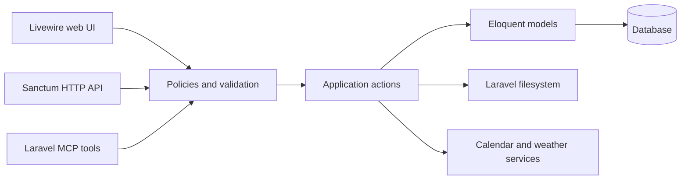

# Architecture and Operations

Sunny keeps business rules in reusable actions so the Livewire interface, HTTP
API, and MCP server can share the same behavior.



## Main code locations

| Area | Location |
| --- | --- |
| Livewire pages and components | `resources/views/pages` and `resources/views/components` |
| Livewire form objects | `app/Livewire/Forms` |
| Reusable business operations | `app/Actions` |
| Models and relationships | `app/Models` |
| Authorization | `app/Policies` and `app/Support/TeamPermissions.php` |
| Web route groups | `routes/*.php` included by `routes/web.php` |
| JSON API | `routes/api.php` and `app/Http/Controllers/Api` |
| MCP server and tools | `routes/ai.php` and `app/Mcp` |
| Scheduled work | `routes/console.php` and `app/Console/Commands` |

## Team scoping

Most signed-in web routes start with `{current_team}`. The
`EnsureTeamMembership` middleware verifies membership and updates the user's
current team when they follow a valid URL for another team.
`SetTeamUrlDefaults` supplies the current team's slug when generating named
routes.

Models such as recipes, inventory items, routines, lists, calendar feeds, and
kiosk devices belong to a team. Queries exposed to users must be scoped to the
authenticated user's current team and authorized through the relevant policy.

The kiosk is a restricted authenticated session. Once a display is paired,
`RestrictKioskSession` prevents that browser session from opening non-kiosk
pages, while still allowing Livewire requests.

## Routine occurrence generation

Routines are templates. `GenerateRoutineOccurrences` materializes the due
occurrence and its steps for a date. Generation is idempotent and also happens
when the kiosk requests a date, so the scheduled warm-up is not required for
correctness.

The scheduler runs this command daily at 00:15:

```bash
php artisan routines:generate --days=7
```

Production must run Laravel's scheduler for this warm-up to occur. The command
uses `withoutOverlapping()` and can safely be run manually after a deployment.

## Queues, files, and integrations

- Team invitation mail implements `ShouldQueue`; production needs a queue
  worker for invitations to be delivered.
- Recipe and inventory photos use Laravel's default filesystem disk. The API
  returns temporary photo URLs rather than storage paths.
- Calendar feeds are fetched from external ICS URLs and parsed with
  `sabre/vobject`.
- Mapbox powers address autocomplete and OpenWeather powers the kiosk weather
  tile when their keys are configured.

## Add a feature

Follow the existing vertical structure: add or extend a model and policy,
place reusable state changes in an action, call the action from the relevant
Livewire/API/MCP surface, and add focused Pest coverage beside the component or
under `tests/`. Keep all team-owned queries explicitly team-scoped.
