# Database ERD

Most tables belong to a team, either directly through `team_id` or through a
parent record such as a checklist or routine. Users reach a team through
`team_members`, and `users.current_team_id` records the team they're working
on.

| Color | Meaning |
| --- | --- |
| Blue | Application tables |
| Red Orange | Laravel default tables |
| Purple | Passport OAuth tables |

```mermaid
---
config:
  theme: default
---
erDiagram
	direction TB
	users {
		integer id PK ""
		varchar name  ""
		varchar email UK ""
		datetime email_verified_at  ""
		varchar password  ""
		text two_factor_secret  ""
		text two_factor_recovery_codes  ""
		datetime two_factor_confirmed_at  ""
		integer current_team_id FK ""
		varchar remember_token  ""
		datetime last_active_at  ""
		datetime created_at  ""
		datetime updated_at  ""
	}

	teams {
		integer id PK ""
		varchar name  ""
		varchar slug UK ""
		boolean is_personal  ""
		varchar timezone  ""
		integer week_start  ""
		json address  ""
		varchar appearance  ""
		integer rotation  ""
		datetime deleted_at  ""
		datetime created_at  ""
		datetime updated_at  ""
	}

	team_members {
		integer id PK ""
		integer team_id FK ""
		integer user_id FK ""
		varchar role  ""
		datetime created_at  ""
		datetime updated_at  ""
	}

	team_invitations {
		integer id PK ""
		integer team_id FK ""
		integer invited_by FK ""
		varchar email  ""
		varchar role  ""
		varchar code UK ""
		datetime expires_at  ""
		datetime accepted_at  ""
		datetime created_at  ""
		datetime updated_at  ""
	}

	recipes {
		integer id PK ""
		integer team_id FK ""
		integer parent_id FK ""
		varchar name  ""
		varchar slug UK ""
		varchar share_token UK ""
		varchar source  ""
		varchar servings  ""
		varchar prep_time  ""
		varchar cook_time  ""
		varchar total_time  ""
		text description  ""
		text ingredients  ""
		text instructions  ""
		text notes  ""
		text nutrition  ""
		json tags  ""
		varchar client_uuid UK "unique per team"
		varchar photo_path  ""
		datetime deleted_at  ""
		datetime created_at  ""
		datetime updated_at  ""
	}

	items {
		integer id PK ""
		integer team_id FK ""
		integer parent_id FK ""
		varchar type  ""
		varchar name  ""
		json metadata  ""
		varchar client_uuid UK "unique per team"
		varchar photo_path  ""
		datetime deleted_at  ""
		datetime created_at  ""
		datetime updated_at  ""
	}

	calendar_feeds {
		integer id PK ""
		integer team_id FK ""
		varchar name  ""
		text url  ""
		varchar color  ""
		datetime last_fetched_at  ""
		datetime last_failed_at  ""
		varchar last_error  ""
		datetime created_at  ""
		datetime updated_at  ""
	}

	checklists {
		integer id PK ""
		integer team_id FK ""
		integer user_id FK ""
		varchar type  ""
		varchar name  ""
		varchar client_uuid UK "unique per team"
		datetime deleted_at  ""
		datetime created_at  ""
		datetime updated_at  ""
	}

	checklist_items {
		integer id PK ""
		integer checklist_id FK ""
		varchar name  ""
		integer position  ""
		datetime completed_at  ""
		integer completed_by FK ""
		varchar client_uuid UK "unique per list"
		datetime created_at  ""
		datetime updated_at  ""
	}

	routines {
		integer id PK ""
		integer team_id FK ""
		integer user_id FK ""
		varchar name  ""
		varchar time_of_day  ""
		varchar frequency  ""
		json weekdays  ""
		integer day_of_month  ""
		date starts_on  ""
		boolean is_active  ""
		varchar client_uuid UK "unique per team"
		datetime deleted_at  ""
		datetime created_at  ""
		datetime updated_at  ""
	}

	routine_steps {
		integer id PK ""
		integer routine_id FK ""
		varchar name  ""
		integer position  ""
		varchar client_uuid UK "unique per routine"
		datetime deleted_at  ""
		datetime created_at  ""
		datetime updated_at  ""
	}

	routine_occurrences {
		integer id PK ""
		integer routine_id FK ""
		date due_on  ""
		datetime generated_at  ""
		datetime created_at  ""
		datetime updated_at  ""
	}

	routine_occurrence_steps {
		integer id PK ""
		integer routine_occurrence_id FK ""
		integer routine_step_id FK ""
		datetime completed_at  ""
		integer completed_by FK ""
		datetime created_at  ""
		datetime updated_at  ""
	}

	kiosk_devices {
		integer id PK ""
		varchar uuid UK ""
		varchar pairing_code UK ""
		varchar name  ""
		varchar user_agent  ""
		varchar last_ip  ""
		integer user_id FK ""
		integer team_id FK ""
		datetime paired_at  ""
		datetime expires_at  ""
		datetime last_seen_at  ""
		datetime created_at  ""
		datetime updated_at  ""
	}

	passkeys {
		integer id PK ""
		integer user_id FK ""
		varchar name  ""
		varchar credential_id UK ""
		json credential  ""
		datetime last_used_at  ""
		datetime created_at  ""
		datetime updated_at  ""
	}

	sessions {
		varchar id PK ""
		integer user_id FK ""
		varchar ip_address  ""
		text user_agent  ""
		text payload  ""
		integer last_activity  ""
	}

	password_reset_tokens {
		varchar email PK ""
		varchar token  ""
		datetime created_at  ""
	}

	personal_access_tokens {
		integer id PK ""
		varchar tokenable_type  ""
		integer tokenable_id  ""
		text name  ""
		varchar token UK ""
		text abilities  ""
		datetime last_used_at  ""
		datetime expires_at  ""
		datetime created_at  ""
		datetime updated_at  ""
	}

	oauth_clients {
		uuid id PK ""
		varchar owner_type  ""
		integer owner_id  ""
		varchar name  ""
		varchar secret  ""
		varchar provider  ""
		text redirect_uris  ""
		text grant_types  ""
		boolean revoked  ""
		datetime created_at  ""
		datetime updated_at  ""
	}

	oauth_auth_codes {
		char id PK ""
		integer user_id FK ""
		uuid client_id FK ""
		text scopes  ""
		boolean revoked  ""
		datetime expires_at  ""
	}

	oauth_access_tokens {
		char id PK ""
		integer user_id FK ""
		uuid client_id FK ""
		varchar name  ""
		text scopes  ""
		boolean revoked  ""
		datetime created_at  ""
		datetime updated_at  ""
		datetime expires_at  ""
	}

	oauth_refresh_tokens {
		char id PK ""
		char access_token_id FK ""
		boolean revoked  ""
		datetime expires_at  ""
	}

	oauth_device_codes {
		char id PK ""
		integer user_id FK ""
		uuid client_id FK ""
		char user_code UK ""
		text scopes  ""
		boolean revoked  ""
		datetime user_approved_at  ""
		datetime last_polled_at  ""
		datetime expires_at  ""
	}

	users||--o{team_members:"belongs to"
	users||--o|teams:"current team"
	users||--o{team_invitations:"invited by"
	users||--o{passkeys:"has"
	users||--o{kiosk_devices:"paired"
	users||--o{sessions:"has"
	users|o--o{checklists:"assigned"
	users|o--o{checklist_items:"completed"
	users|o--o{routines:"assigned"
	users|o--o{routine_occurrence_steps:"completed"
	teams||--o{team_members:"has members"
	teams||--o{team_invitations:"has invitations"
	teams||--o{recipes:"has"
	teams||--o{items:"has"
	teams||--o{calendar_feeds:"has"
	teams||--o{checklists:"has"
	teams||--o{routines:"has"
	teams||--o{kiosk_devices:"has"
	recipes||--o{recipes:"remix of"
	items||--o{items:"nested in"
	checklists||--o{checklist_items:"has items"
	routines||--o{routine_steps:"has steps"
	routines||--o{routine_occurrences:"generates"
	routine_steps||--o{routine_occurrence_steps:"instantiated as"
	routine_occurrences||--o{routine_occurrence_steps:"has steps"
	users||--o{oauth_auth_codes:"authorized"
	users||--o{oauth_access_tokens:"authorized"
	users|o--o{oauth_device_codes:"approved"
	oauth_clients||--o{oauth_auth_codes:"issued"
	oauth_clients||--o{oauth_access_tokens:"issued"
	oauth_clients||--o{oauth_device_codes:"issued"
	oauth_access_tokens||--o|oauth_refresh_tokens:"refreshed by"

	sessions:::Laravel
	password_reset_tokens:::Laravel
	personal_access_tokens:::Laravel
	oauth_clients:::Passport
	oauth_auth_codes:::Passport
	oauth_access_tokens:::Passport
	oauth_refresh_tokens:::Passport
	oauth_device_codes:::Passport

	classDef Rose :,stroke-width:1px, stroke-dasharray:none, stroke:#FF5978, fill:#FFDFE5, color:#8E2236
	classDef Laravel stroke:#FF2D20, fill:#FFD6D4, color:#BF2118
	classDef Passport stroke:#7C3AED, fill:#EDE9FE, color:#5B21B6
```

The same diagram is in the repository's `README.md`. Update both when a
migration adds or changes a table.
